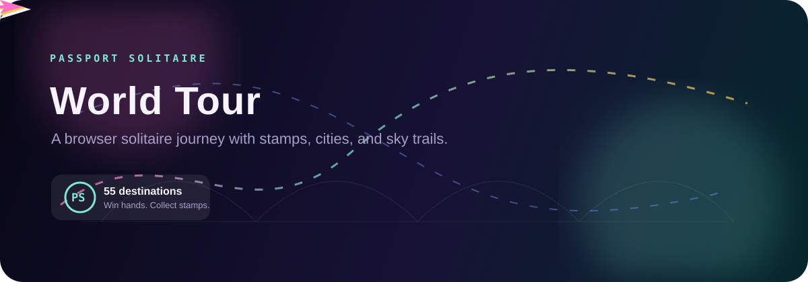

<p align="center">
  
</p>

# Passport Solitaire - World Tour

<p align="center">
  <a href="https://dacameragirl.github.io/passport-solitaire-world-tour/"></a>
  
  
</p>

Travel-themed Klondike solitaire. Pick a city, win a hand, and collect passport stamps from 55 destinations around the world.

Built as a small gift project: playful, polished, and personal without needing accounts, servers, installs, or a build step.

## Destinations

55 cities across 7 regions, each with a custom hand-drawn SVG landmark on the card back:

- **Europe**: Paris, London, Rome, Barcelona, Amsterdam, Prague, Athens, Santorini, Lisbon, Vienna, Edinburgh, Istanbul
- **Asia**: Tokyo, Kyoto, Bangkok, Bali, Singapore, Hong Kong, Seoul, Shanghai, Mumbai, Kathmandu, Hanoi, Dubai
- **Africa**: Marrakech, Cairo, Cape Town, Nairobi, Zanzibar, Casablanca, Accra, Tunis
- **Americas**: Rio de Janeiro, New York, New Orleans, Havana, Mexico City, Buenos Aires, Cartagena, Machu Picchu, Vancouver
- **Oceania**: Sydney, Auckland, Fiji, Honolulu
- **Middle East**: Jerusalem, Petra, Muscat, Doha
- **Wild Cards**: Easter Island, Maldives, Svalbard, Galapagos, Faroe Islands, Patagonia

## Features

- Klondike solitaire with Easy, Medium, and Hard difficulty tiers.
- Passport collection saved in `localStorage`, including stamp dates and region progress.
- Custom SVG landmark card backs for every destination.
- Undo with `Ctrl+Z`, auto-foundation with `A`, timer, move counter, and win screen.
- Animated travel atmosphere with a polished README hero, destination colors, stamp styling, and world-tour flavor.
- Fully offline single-file app in `index.html`.

## Play

Live site:

```text
https://dacameragirl.github.io/passport-solitaire-world-tour/
```

Local preview:

```bash
python -m http.server 8000
```

Then open:

```text
http://localhost:8000
```

## Controls

- Click the stock to draw cards.
- Click a face-up card to auto-send it to the foundation when legal, or select it for a move.
- Click a tableau column or foundation pile to place the selected card or stack.
- Use `Undo` or `Ctrl+Z` to step back.
- Use `A` for auto-foundation.
- Press `Escape` to clear the current selection.

## Files

| File | Purpose |
| --- | --- |
| `index.html` | Complete playable game: markup, styles, data, and JavaScript |
| `docs/assets/passport-readme-hero.svg` | Animated airplane README artwork |

## Deploy

For GitHub Pages, set the repository Pages source to the `main` branch root. There is no build step.
